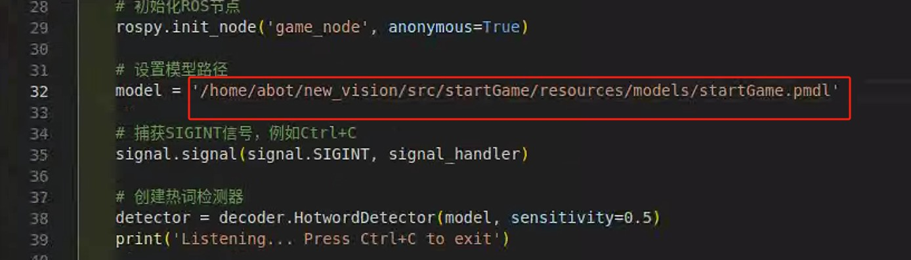
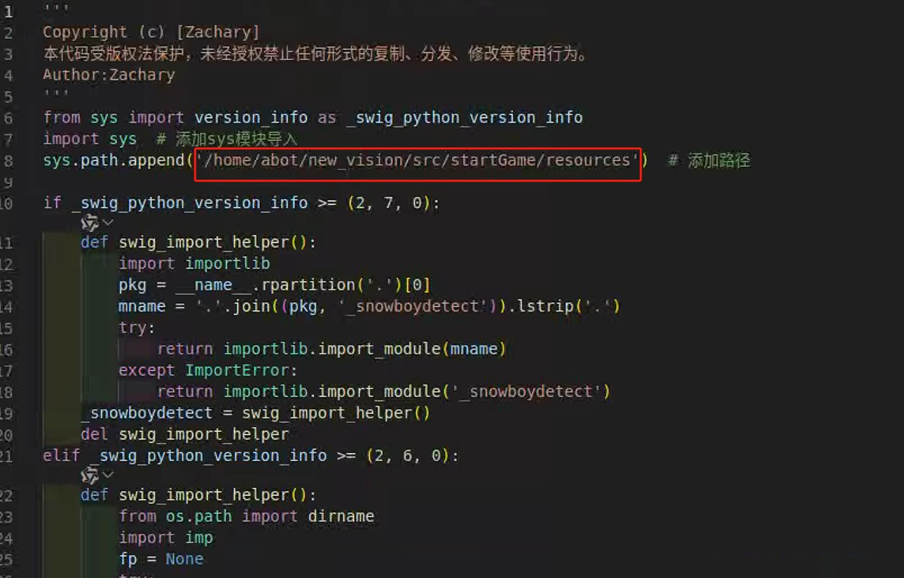
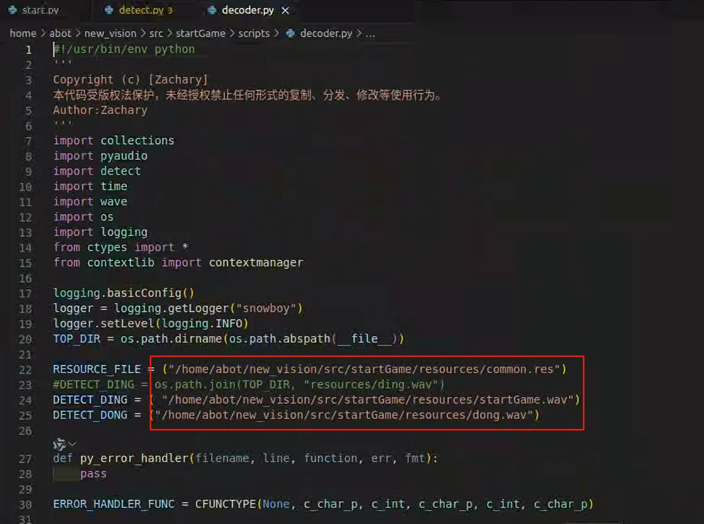

# 环境配置指南
​**Author​**​：Zachary  
​**update_date​**​：2025年4月
## 一、安装依赖

### 1. 安装 PulseAudio
```bash
sudo apt --fix-broken install
sudo apt-get install pulseaudio
```

### 2. 安装 SoX 测试工具
```bash
sudo apt-get install sox
# 测试录音与播放功能
sox -d -d
```
> 提示：测试时对着麦克风说话，确认能听到回放声音，按 `Ctrl+C` 退出测试

### 3. 安装 SWIG (版本 >3.0.10)
```bash
sudo apt-get install swig
# 验证版本
swig -version
```

### 4. 安装 ATLAS 数学库
```bash
sudo apt-get install libatlas-base-dev
```

### 5. 安装 Python 音频库
```bash
sudo apt-get install python3-pyaudio
```

---
## 二、录音功能测试
```bash
# 生成测试录音文件（默认录制8秒）
rec temp.wav
# 按 Ctrl+C 提前结束录音
```

---

## 三、配置项目路径

### 1. 进入脚本目录
```bash
cd startGame/scripts
```

### 2. 修改配置文件
- **start.py**  
  ```bash
  code start.py  # 或使用其他编辑器如 nano/vim
  ```
  修改模型路径：图片如果打不开，文件夹里面有
  
  

- **detect.py**  
  ```bash
  code detect.py
  ```
  修改如下路径：姚哥:
  [文件]
  
  姚哥:
  [文件]
  
  姚哥:
  [文件]
  
  

- **decoder.py**  
  ```bash
  code decoder.py
  ```
  需修改三处路径：
  

---

## 四、启动脚本
```bash
roslaunch startGame GameStart.launch
```

> **前提条件**  
> - 已安装 ROS 框架
> - 已完成项目文件克隆和依赖配置
> - 麦克风设备已正确连接
```

补充说明
1. 路径修改建议使用绝对路径
2. 若使用非Python3环境，需替换`python3-pyaudio`为对应版本
3. ROS相关操作需确保`catkin`工作空间已正确构建
4. 遇到权限问题时，可尝试在命令前加`sudo`
5. 若问题无法解决，可联系公司客服
```
--- 
- ​作者姓名：Zachary     
​**​版权声明​**​  
- © Zachary版权所有，转载需注明出处

---